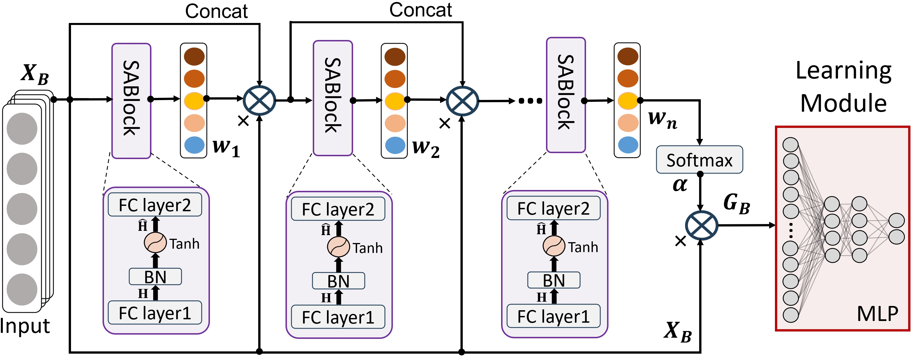

# 1 Supervised Feature Selection with Stackable Attention Networks for Tabular Data

This is the offcial repository of paper "Supervised Feature Selection with Stackable Attention Networks for Tabular Data"



# 2 Prepare Datasets

All the dataset can be found in OpenML(https://www.openml.org/) and Datamicroarray(https://github.com/ramhiser/datamicroarray/). Here, we provide part of data as a demo.

# 3 Run SAFS

## 3.1 install requirements

1. to run our code, **Please make sure your python version is >=3.6.**
2. install all the requirements, we assume that you have installed torch according to your environment
```
pip install -r ./requirements.txt
```
## 3.2 Run

Please run the ```main_single_train.py```.
